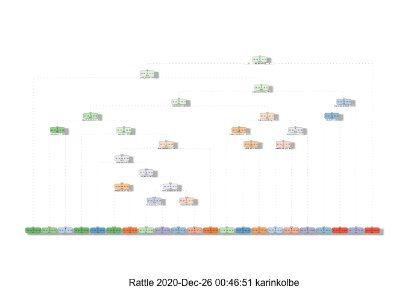

## Summary
Subjects were ask to perform barbell lifts correctly and incorrectly in 5 different ways. See http://groupware.les.inf.puc-rio.br/har.
This assignment is to use the Test data to build a prediction model to accurately predict a set of 20 entries.

The approach used is to split the Data into testing and training. Then apply two different models, a Decision Tree and Random Forrest. The latter is much more accurate and is used to apply to the Validation sample.

#### Packages

```r
library(dplyr)  
library(knitr)

library(randomForest)  
library(caret)
library(rattle)
library(gbm)
library(rpart)
```


```r
setwd("~/dataScience/8 Practical Machine Learning/Assig")
rm(list=ls())
```


## Download and read data

```r
#Function to download & read files
getData <- function (SrcFile, SrcURL){
        download.file(url = SrcURL, destfile = SrcFile, method = "curl")
        read.csv(SrcFile ,na.strings=c(" ", "", "#DIV/0!", "NA"))
        }

Training0 <- getData("pml-training.csv",
        "https://d396qusza40orc.cloudfront.net/predmachlearn/pml-training.csv")
Finaltest <- getData("pml-testing.csv",
        "https://d396qusza40orc.cloudfront.net/predmachlearn/pml-testing.csv")

print(dim(Training0))
```

```
## [1] 19622   160
```

```r
print(dim(Finaltest))
```

```
## [1]  20 160
```

## Tidy the data

```r
#Remove columns X,  user_name, timestamps, & window info

Training1 <- Training0[,-c(1:7)]
print(dim(Training1))
```

```
## [1] 19622   153
```

```r
#Remove NA rows
Training2<-Training1[,!apply(Training1,2,function(x) any(is.na(x)) )]
print(dim(Training2))
```

```
## [1] 19622    53
```

## Split data into training and testing

```r
set.seed(679)
splitter<-createDataPartition(Training2$classe, p=0.6, list =FALSE)
train <- Training2[splitter,]
test <- Training2[-splitter,]
print(dim(train))
```

```
## [1] 11776    53
```

```r
print(dim(test))
```

```
## [1] 7846   53
```


## Decision Tree

```r
set.seed(567)
model_DT<-rpart(classe ~ .,data=train,method="class")
```


```r
fancyRpartPlot(model_DT)
```

<!-- -->

Now apply to Test data

```r
predict_DT <-predict(model_DT,newdata=test,type="class")
conMatrix_DT <- confusionMatrix(predict_DT, test$classe)
conMatrix_DT
```

```
## Confusion Matrix and Statistics
## 
##           Reference
## Prediction    A    B    C    D    E
##          A 2015  259   87  169   67
##          B   91  990  125  123  127
##          C   35  104 1029  178  152
##          D   57   89   88  685   55
##          E   34   76   39  131 1041
## 
## Overall Statistics
##                                           
##                Accuracy : 0.7341          
##                  95% CI : (0.7242, 0.7439)
##     No Information Rate : 0.2845          
##     P-Value [Acc > NIR] : < 2.2e-16       
##                                           
##                   Kappa : 0.6615          
##                                           
##  Mcnemar's Test P-Value : < 2.2e-16       
## 
## Statistics by Class:
## 
##                      Class: A Class: B Class: C Class: D Class: E
## Sensitivity            0.9028   0.6522   0.7522  0.53266   0.7219
## Specificity            0.8963   0.9264   0.9276  0.95595   0.9563
## Pos Pred Value         0.7759   0.6799   0.6869  0.70329   0.7880
## Neg Pred Value         0.9587   0.9174   0.9466  0.91254   0.9385
## Prevalence             0.2845   0.1935   0.1744  0.16391   0.1838
## Detection Rate         0.2568   0.1262   0.1311  0.08731   0.1327
## Detection Prevalence   0.3310   0.1856   0.1909  0.12414   0.1684
## Balanced Accuracy      0.8996   0.7893   0.8399  0.74430   0.8391
```

Accuracy is low at 74.31% so try a different approach.

### Random Forest

Use with cross validation

```r
set.seed(789)
model_RF <- randomForest(classe~., data=train, method="class",
                        trControl = traincontrol(method="cv"),number=3)
model_RF
```

```
## 
## Call:
##  randomForest(formula = classe ~ ., data = train, method = "class",      trControl = traincontrol(method = "cv"), number = 3) 
##                Type of random forest: classification
##                      Number of trees: 500
## No. of variables tried at each split: 7
## 
##         OOB estimate of  error rate: 0.59%
## Confusion matrix:
##      A    B    C    D    E class.error
## A 3343    5    0    0    0 0.001493429
## B   12 2261    6    0    0 0.007898201
## C    0   18 2033    3    0 0.010223953
## D    0    0   18 1911    1 0.009844560
## E    0    0    2    5 2158 0.003233256
```


```r
predict_RF <- predict(model_RF,test, type='class')
conMatrix_RF <- confusionMatrix(predict_RF,test$classe)
conMatrix_RF
```

```
## Confusion Matrix and Statistics
## 
##           Reference
## Prediction    A    B    C    D    E
##          A 2231    4    0    0    0
##          B    1 1512   14    0    0
##          C    0    2 1354   20    2
##          D    0    0    0 1264    3
##          E    0    0    0    2 1437
## 
## Overall Statistics
##                                           
##                Accuracy : 0.9939          
##                  95% CI : (0.9919, 0.9955)
##     No Information Rate : 0.2845          
##     P-Value [Acc > NIR] : < 2.2e-16       
##                                           
##                   Kappa : 0.9923          
##                                           
##  Mcnemar's Test P-Value : NA              
## 
## Statistics by Class:
## 
##                      Class: A Class: B Class: C Class: D Class: E
## Sensitivity            0.9996   0.9960   0.9898   0.9829   0.9965
## Specificity            0.9993   0.9976   0.9963   0.9995   0.9997
## Pos Pred Value         0.9982   0.9902   0.9826   0.9976   0.9986
## Neg Pred Value         0.9998   0.9991   0.9978   0.9967   0.9992
## Prevalence             0.2845   0.1935   0.1744   0.1639   0.1838
## Detection Rate         0.2843   0.1927   0.1726   0.1611   0.1832
## Detection Prevalence   0.2849   0.1946   0.1756   0.1615   0.1834
## Balanced Accuracy      0.9994   0.9968   0.9930   0.9912   0.9981
```

## Out of sample error rate 
For the Decision Tree the accuracy was 74.3% and Random Forest is 99.4%, thus use this for the Validation 


# Validation
Apply the Random Forest model to the Validation data

```r
TestResult <- predict(model_RF,Finaltest, type="class")
TestResult
```

```
##  1  2  3  4  5  6  7  8  9 10 11 12 13 14 15 16 17 18 19 20 
##  B  A  B  A  A  E  D  B  A  A  B  C  B  A  E  E  A  B  B  B 
## Levels: A B C D E
```


